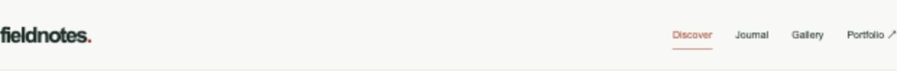
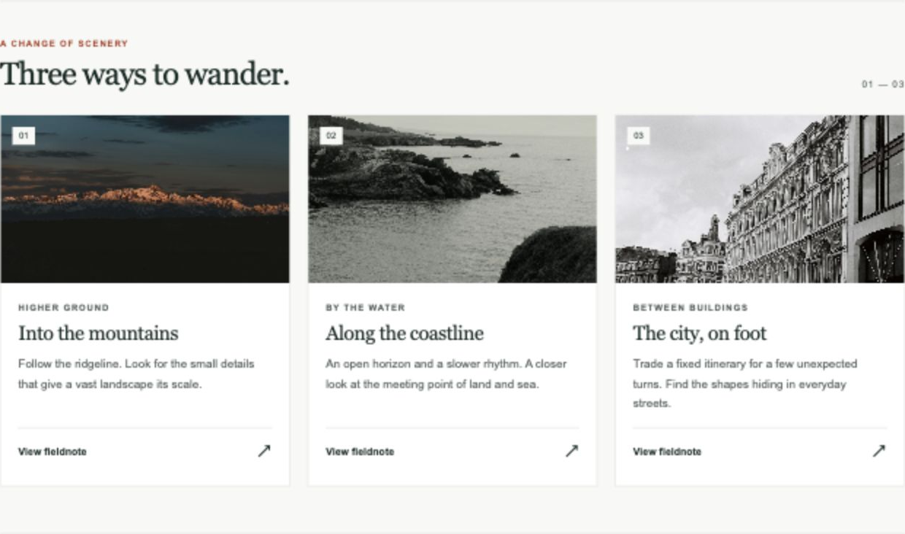
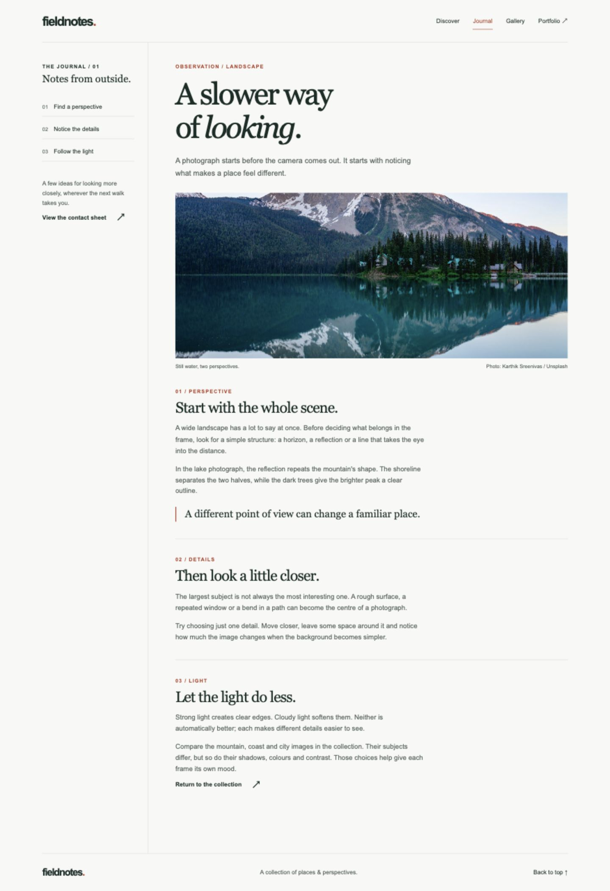
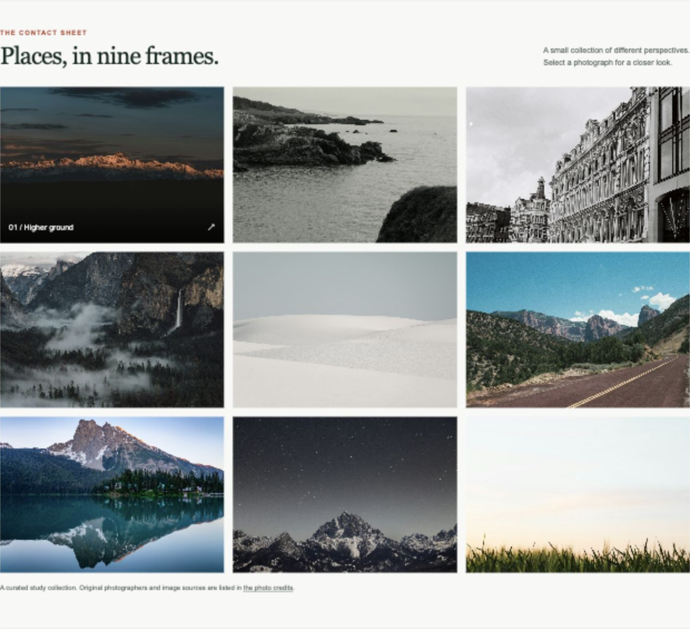
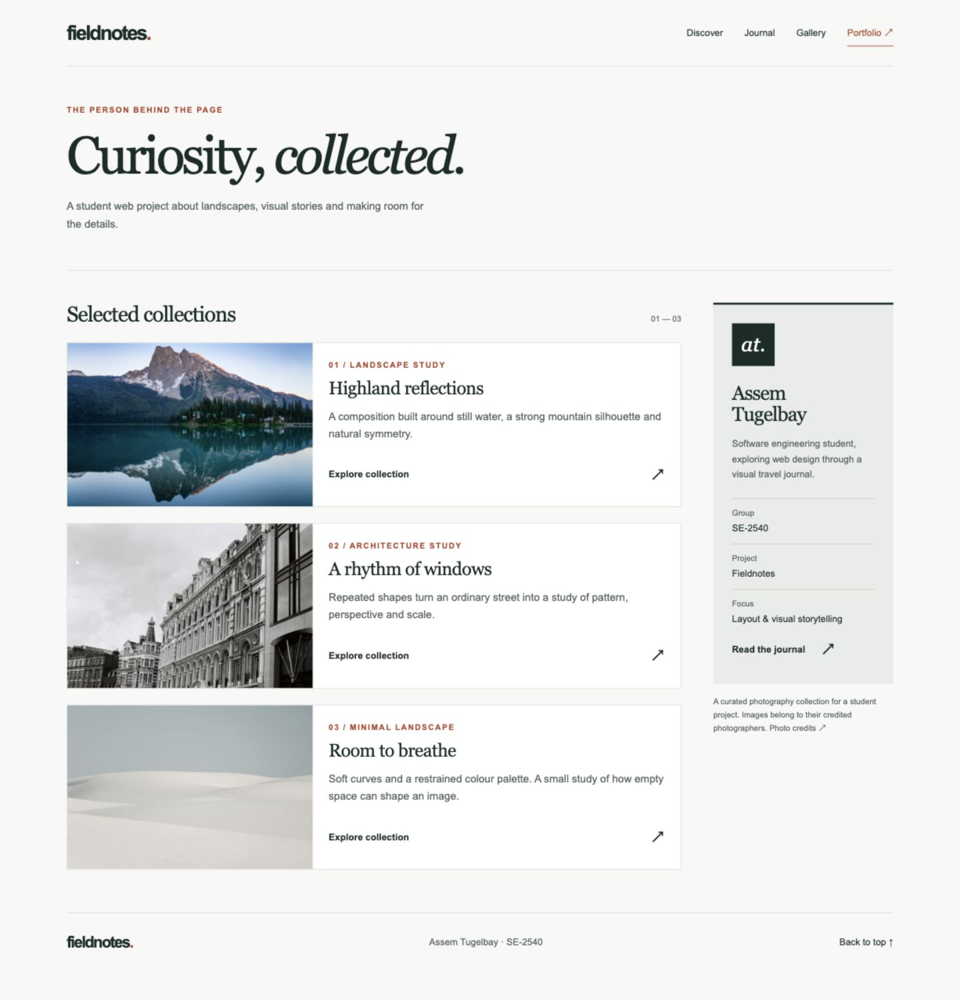
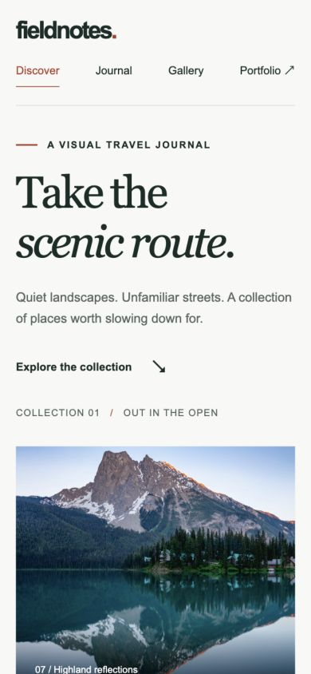

# Fieldnotes — Advanced CSS

**Live website:** [Open Fieldnotes](https://asemtygelbaeva-byte.github.io/assignment2_frontend/)

**Student:** Assem Tugelbay  
**Group:** SE-2540  
**Assignment:** #2 — Advanced CSS (Flexbox & Grid)

**Repository:** [asemtygelbaeva-byte/assignment2_frontend](https://github.com/asemtygelbaeva-byte/assignment2_frontend)

Fieldnotes is a small travel journal with a photo collection, an article page and a portfolio. The pages share the same navigation, colours and typography. The project uses plain HTML, CSS and a short JavaScript file for the photo viewer. No CSS frameworks, external fonts or build tools are required to run it.

## Part 1 — Flexbox

### Task 0 — Navigation Bar

The header uses `display: flex`, `justify-content: space-between` and `align-items: center`. The wordmark stays on the left and navigation stays on the right. The links form a second flex container with a consistent `gap`. On narrow screens, the navigation wraps below the wordmark.

**HTML:** the shared `.site-header` and `.site-nav` on all three pages.  
**CSS:** the section marked `Task 0` in [styles.css](styles.css).



### Task 1 — Card Row

The Discover page contains three cards. Each has an image, title, description and a working **View fieldnote** button. `.card-row` is a flex container with equal-width children. `align-items: stretch` gives the cards equal height within the desktop row. Each card is also a flex column; `margin-top: auto` keeps the buttons aligned even when the descriptions have different lengths.

The cards lift slightly and gain a shadow on hover. Below 760px, they become a single column.

**HTML:** `#stories` in [index.html](index.html).  
**CSS:** `.card-row`, `.story-card` and `.card-content`.



## Part 2 — Grid System

### Task 2 — Page Layout with Grid Areas

The Journal page uses a parent grid with two columns and three rows:

```css
grid-template-columns: minmax(190px, 250px) minmax(0, 1fr);
grid-template-rows: auto 1fr auto;
grid-template-areas:
  "header header"
  "sidebar main"
  "footer footer";
```

The header and footer span both columns. The contents sidebar is on the left, and the article is on the right. Each section is assigned its named `grid-area`. On mobile, the same areas form a single column in the order header, sidebar, main, footer.

**HTML:** [journal.html](journal.html).  
**CSS:** the section marked `Task 2`.



### Task 3 — Image Gallery

The gallery contains **nine different photographs**. `repeat(3, minmax(0, 1fr))` creates equal-width columns, while `grid-auto-rows: 280px` gives desktop rows the same height. The gap is `1rem`. Images fill their cells with `object-fit: cover`.

Hovering over an image reveals its caption. Keyboard focus reveals the same caption. On devices without hover, captions stay visible. Selecting a photograph opens a larger version; the Close button, Escape key or backdrop dismisses it. The layout changes to two columns below 760px and one below 440px.

**HTML:** `#gallery` in [index.html](index.html).  
**CSS:** `.gallery-grid`, `.gallery-item` and `.gallery-caption`.



## Part 3 — Combining Flexbox & Grid

### Task 4 — Portfolio Page

The portfolio combines both layout methods:

- The header uses Flexbox for navigation.
- `.portfolio-layout` uses Grid for the projects area on the left and the information sidebar on the right.
- Each project card and its content use Flexbox to arrange the image, title, description and button.
- The footer sits below the complete main section and spans the page's content width.

The sidebar moves below the projects on small screens. The three collection buttons open their corresponding photographs and descriptions.

**HTML:** [portfolio.html](portfolio.html).  
**CSS:** the section marked `Task 4`.



## Responsive design and accessibility

The CSS includes adjustments at 1000px, 760px and 440px. The site uses semantic landmarks, descriptive image alt text, visible keyboard focus, a skip link and reduced-motion support. The native `<dialog>` manages focus while a photo is open and restores focus after closing.



## Work process

The travel journal theme gave the cards, gallery and portfolio a shared purpose. The page structure was created first, followed by the Flexbox navigation and cards. The Journal page was arranged with named Grid areas, and the photo gallery used equal-sized grid cells. The portfolio then combined a grid for the main layout with flex containers inside its cards.

The final pass covered mobile layouts, image cropping, keyboard interaction and local file links. A tall image issue in the portfolio was corrected by setting the images' CSS height to `auto`. The report screenshots were captured from the working pages.

## Verification

- All three pages checked at desktop and phone widths; no horizontal overflow found in the checked layouts.
- Three desktop story cards measured at the same height.
- Nine gallery images loaded successfully; gallery cells had equal heights.
- Card and portfolio buttons opened the intended photo viewer.
- Escape and the Close button dismissed the viewer; focus returned to its trigger.
- All local asset paths and section links checked.
- `script.js` passed `node --check`.

## Files

```text
assignment2-frontend/
├── index.html
├── journal.html
├── portfolio.html
├── styles.css
├── script.js
├── assets/
│   ├── favicon.svg
│   └── images/                 # 9 local photographs
├── screenshots/               # task and responsive screenshots
├── README.md
├── CREDITS.md
├── DEFENSE_RU.md
└── SUBMISSION_RU.md
```

## Resources

- [W3Schools — CSS Flexbox](https://www.w3schools.com/css/css3_flexbox.asp)
- [W3Schools — CSS Grid](https://www.w3schools.com/css/css_grid.asp)
- [W3Schools — Box Sizing](https://www.w3schools.com/css/css3_box-sizing.asp)
- [Flexbox Froggy](https://flexboxfroggy.com/)
- [Photo credits and source links](CREDITS.md)

The photographs are credited to their original authors. This project does not claim them as original student photography.
